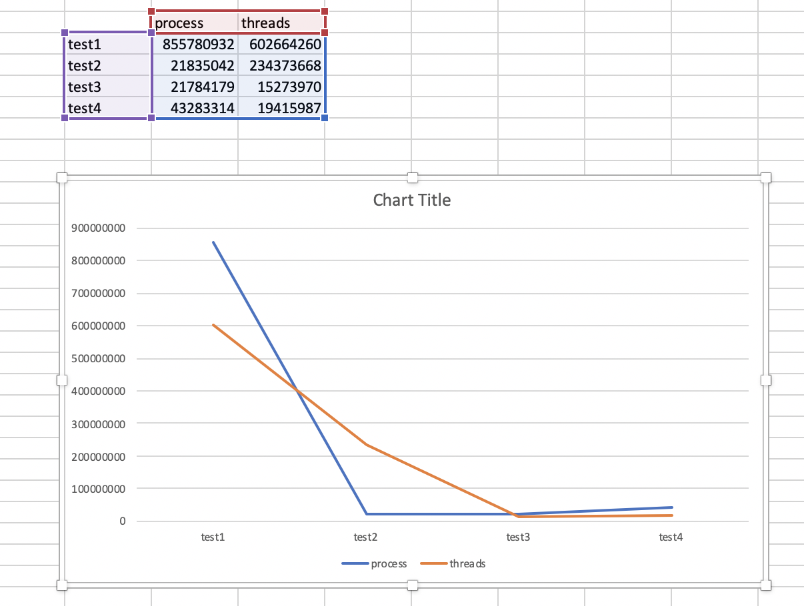

**Swetul Patel**

**compilation and run**
	MAKE - make all or make Threads or make Processes
	RUN - ./Threads or ./Processes

**PROBLEM :** Compute PI using Fixed-Point arithmetic and Chudnovsky algorithm.

**Solution to the Problem:**
Using mathematical formula to calculate each value of RHS equation for every K in the series and adding it at the end to divide by a constant.
Used the GMP library since it can be used to compute large arithmetic operations.
Mostly used the mpf_t floating point variable to do the geometric series calculations.

*During a process*, the solution would work just as explained above, depending on the Number of workers(WORKERS) and maximum number of workers working at a given time(MAX_WORKERS), the program will calculate a k value to iterate to. One process will then complete the execution and determine the value of PI.

*During threads*, the solution will use global variable minK to divide the workload it has been assigned among active threads(MAX_WORKERS) and at any given time there are several workers working on computing the different values of k from the geometric series. this is then added up to give a result of PI as shown in the console.

Tasks are distributed by the **task_division(work)** function depending on whether process or thread is being executed. threads divide the task by looking at the amiable number of workers and the maximum number of workers there can working at any given time.

**_Tests conducted on the above solutions._**

To tests the above programs here are a few variables that were altered to see performance.
a) Precision - denoted as PR in the program
b) number of active workers - MAX_WORKERS
c) Total number of workers - WORKERS

 To avoid presenting a lot of information for the purposes of evaluation I have omitted the values of PI generated and we will assume they are generated properly.

**On terminal - Aviary.cs.umanitoba.ca**

**CHANGING ONLY MAX_WORKERS**

PR = 512
WORKERS = 50000
MAX_WORKERS = 32
k = PR / MAX_WORKERS; 	k- here is the geometric series variable

time to execute(PROCESS) = 1s, 855780932ns with 50000 total workers used in that time.
time to execute(THREADS) = 0s, 602664260ns with 50000 total workers used in that time.

PR = 512
WORKERS = 50000
MAX_WORKERS = 64

Time to execute(PROCESS) = 17s, 218315042ns with 50000 total workers used in that time.
Time to execute(THREADS) = 6s, 234373668ns with 50000 total workers used in that time.

As we see above increasing the number of available workers really benefits the thread solution it is almost taking only 10% of the Process solution time. This is a great benefit of using threads.

**CHANGING THE total number of workers**

PR = 256
WORKERS = 512
MAX_WORKERS = 32

Time to execute(PROCESS) = 0s, 21784179ns with 512 total workers used in that time.
Time to execute(THREADS) = 0s, 15273970ns with 512 total workers used in that time.

PR = 256
WORKERS = 1024
MAX_WORKERS = 32

Time to execute(PROCESS) = 0s, 43283314ns with 1024 total workers used in that time.
Time to execute(THREADS) = 0s, 19415987ns with 1024 total workers used in that time.

As we see above, increasing the total number of workers helps the threads as there are now more so they can compute the digits of PI faster, Threads are better but they get even better when there are more threads in total.

Based on the testing done, changing PR only lead to better precision in calculation PI it did not have significant change in performance, it was negligent enough to be omitted.

As these values of WORKERS, MAX_WORKERS i.e the number of threads and processes scaled higher and higher the difference between the time it takes for Processes to compute PI and Threads to compute PI grew larger and larger, I think this is due too the fact that at least on LINUX, threads are cheap when we need to do small snipets of a program( in our case calculating the result of each k term).

